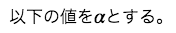
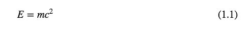
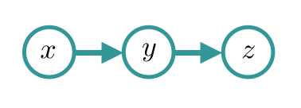
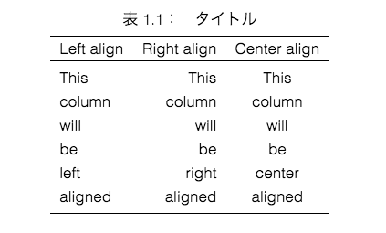

# maron

## 概要

Markdown形式のドキュメントを論文の書式でプレビュー、PDF書き出しができるアプリです。

論文の書式を表現するためにMarkdownを拡張しています。

## 使い方

### 数式

文章の途中に$で囲まれた部分があれば数式として表示されます。

例：

```
以下の値を$\alpha$とする。
```



$$で囲めばtexのalign環境として表示されます。

例：

```
$$
E = mc^2
$$
```



### 画像

```

```

で画像を挿入できます。

また、```[fig](ラベル)```で図番号を参照できます。

例：
```

```


### 表

```
| Left align | Right align | Center align |
|:-----------|------------:|:------------:|
| This | This | This |
| column | column | column |
| will | will | will |
| be | be | be |
| left | right | center |
| aligned | aligned | aligned |
|title:test:ref:tb|
```

このように書くと以下のように出力されます。
一番最後の行は「title:タイトル:ref:ラベル」の形式でタイトルとラベルを設定します。

また、```[table](ラベル)``` で表番号を参照できます。



## LICENSE
This software is released under the MIT License, see LICENSE.txt.

This software includes the work that is distributed in the Apache License 2.0

[http://www.apache.org/licenses/LICENSE-2.0.txt](http://www.apache.org/licenses/LICENSE-2.0.txt)