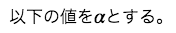
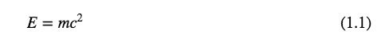
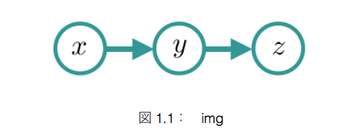

# maron

## 概要

Markdown形式のドキュメントを論文の書式でプレビュー、PDF書き出しができるアプリです。

論文の書式を表現するためにMarkdownを拡張した書き方をします。

プレビューするだけなので、エディタ機能はありません。

## ダウンロード

[リリースページ](https://github.com/taroc/maron/releases)からダウンロードできます。

## 使い方

「ファイル>開く」でMarkdownファイルを開きます。内容が更新されれば自動でリロードします。

「ファイル>PDFに書き出し」でPDFで書き出せます。

「表示>目次を表示」で目次を自動生成します。

## 書き方

### 数式

文章の途中に$で囲まれた部分があれば数式として表示されます。

例）

Markdown：
```md
以下の値を$\alpha$とする。
```

表示：



$$で囲めばtexのalign環境として表示されます。

例）

Markdown：
```md
$$
E = mc^2
$$
```

表示：



### 画像

Markdown：
```md

```

で画像を挿入できます。

また、```[fig](ラベル)```で図番号を参照できます。

例）

Markdown：
```md

```

表示：



### 表

Markdown：
```md
| Left align | Right align | Center align |
|:-----------|------------:|:------------:|
|  This      |      This   |     This     |
|  column    |    column   |    column    |
|  will      |      will   |     will     |
|  be        |        be   |      be      |
|  left      |     right   |    center    |
|  aligned   |   aligned   |   aligned    |
|title:test:label:tb|
```

このように書くと以下のように出力されます。
一番最後の行は```title:タイトル:label:ラベル```の形式でタイトルとラベルを設定します。

また、```[table](ラベル)``` で表番号を参照できます。

表示：


### 表紙

コードブロック要素の言語をfront_coverとして、中身に表紙の内容を書くと表紙がつきます。

```md
    ```front_cover
    {
        "category" : "卒業論文 or 修士論文",
        "title" : "タイトル",
        "subtitle" : "英語のタイトルとか",
        "department1" : "所属1",
        "department2" : "所属2",
        "name1" : "名前",
        "name2" : "名前を英語で",
        "teach" : "指導教員",
        "date" : "提出日"
    }

    ```
```

## LICENSE
This software is released under the MIT License, see LICENSE.txt.

This software includes the work that is distributed in the Apache License 2.0

[http://www.apache.org/licenses/LICENSE-2.0.txt](http://www.apache.org/licenses/LICENSE-2.0.txt "apache license 2.0")
